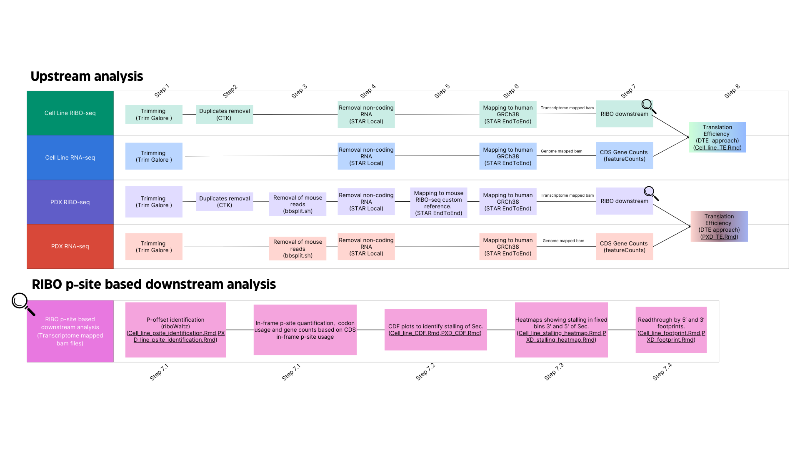

# Selenocysteine tRNA methylation promotes oxidative stress resistance in melanoma metastasis
Scripts related to the analysis of RIBO-seq and bulkRNA-seq data of FTSJ1 KO cell lines and PDX data from primary and metastasis tumors by Nease et al.

## DATA AVAILABILITY

* Sequencing reads and processed counts (raw and normalized counts) can be downloaded from [**GEO: X**]

## DATA ANALYSIS
Schematic description of the data processing workflow. 

## UPSTREAM ANALYSIS
Upstream analysis can be performed using the [ALL_DATATYPES_upstream.sh](https://github.com/abcwcm/piskounova_ribo/blob/main/analysis_scripts/upstream_analysis/ALL_DATATYPES_upstream_updated.sh) script. It is written to analyze four different experimental types; Cell line RIBO-seq, PDX RIBO-seq, Cell line RNA-seq and PDX RNA-seq. In order to run it, reference files have to be set in config.txt file and aim and raw data folder have to be set in the command line. The script works as follows;

    > `./ALL_DATATYPES_upstream.sh --aim RIBO_CELL|RIBO_PDX|RNA_CELL|RNA_PDX --config config.txt  --raw-data-dir <data_directory_path>`

Example:

    >`./ALL_DATATYPES_upstream_updated.sh --aim RIBO_CELL --config config.txt --raw-data-dir test_Data/ribo_cell/`

The script performs the following steps:

- **Step 1**. Reads from bulk RNA-seq and RIBO-seq libraries from cell lines are trimmed using `Trim Galore` v0.6.10 to remove nucleotides with low quality and adaptor contamination.

- **Step 2**. For RIBO-seq data, duplicated reads created by PCR amplification are removed based on UMIs and using `fastq2collapse.pl` and `stripBarcode.pl` scripts from `CTK tool kit`.

- **Step 4**. From `Trim Galore` output for RNA-seq and `CTK` output for RIBO-seq, **non-coding RNA** is removed using a custom reference genome composed by miRNA, rRNA, tRNA and lncRNA sequences using `STAR` v2.7.9a with `–alignEndsType Local`.

- **Step 6**. `STAR` is used again with `–alignEndsType EndToEnd` and `–quantMode TranscriptomeSAM`, using **GRCh38 primary assembly** genome and **MANE v1.2** annotation file to obtain transcriptome and genome mapping coordinates. 

- **Step 7**. Using bam files originated from the mapping of RNA-seq reads to the whole genome, quantification of reads mapping to CDS regions is run using `featureCounts` v 2.0.1.

For Xenograft data, in addition to the steps described above, mouse reads are removed in two different ways:

- **Step 3**. Before non-coding RNA removal `bbsplit.sh` from `BBMap` v38.90 is used with `ambiguous2==”toss”` using gencode **GRCh38 human** and **GRCm39 mouse** references keeping only reads that mapped unambiguously to human reference. 

- **Step 5**. In the next step, a custom reference using **mouse healthy liver RIBO-seq** data is created and reads that didn’t align to this reference (=Human reads) using `STAR` and `–alignEndsType EndToEnd` are kept for following steps. 

- **Step 8**. Translation efficiency (TE) is calculated based on the CDS gene counts obtained from bulk RNA-seq and counts obtained for RIBO-seq data from `In-frame psite identification and quantification`.([Cell_line_TE.Rmd](https://github.com/abcwcm/piskounova_ribo/blob/main/analysis_scripts/downstream_analysis/Cell_lines/Script5_cell_lines_Translation_Efficiency.Rmd),[PXD_TE.Rmd](https://github.com/abcwcm/piskounova_ribo/blob/main/analysis_scripts/downstream_analysis/Xenograft/Script5_PDX_Translation_Efficiency.Rmd))

## RIBO _P-SITE BASED DOWNSTREAM ANALYSIS

Using ribosome profiled bam files outputed from mapping to the transcriptome in `Step 6`, in both cell lines and PDX, samples in-frame psite coverages were calculated using `riboWaltz` package. This in-frame _p-site coverages were used then to **i**) calculate stalling based on downstream cumulative distribution function (CDF), **ii**) to identify readthrough by 5’ and 3’ footprints,  **iii**) to calculate psite codon usage and **iv**) finally to quantify CDS in-frame _p-site counts for all genes to use in translation efficiency (TE) analysis. 

- **Step 7.1: In-frame _p-site identification and quantification**:

For in-frame _p-site coverage quantification, reads longer than 25 pb and shorter than 45 pb are kept and P-offsites are calculated for each read length using _p-site function with default arguments. Based on those P-offsite, CDS in-frame _p-site coverages are quantified for each gene and saved for TE analysis. Once, _p-site position of each read is identified, only in-frame _p-sites were kept for further stalliing CDF and heatmaps and readthrough analysis.  _P-site coverages for each Selenoprotein can be found [here](https://github.com/abcwcm/piskounova_ribo/tree/main/selenoproteins_psite_counts). Codon usage of _p-site is calculated using `codon_usage_psite` function from `riboWaltz` (Figure X). ([Cell_line_psite_identification.Rmd](https://github.com/abcwcm/piskounova_ribo/blob/main/analysis_scripts/downstream_analysis/Cell_lines/Script1_cell_lines_inframe_psite_idenitification.Rmd),[PXD_line_psite_identification.Rmd](https://github.com/abcwcm/piskounova_ribo/blob/main/analysis_scripts/downstream_analysis/Xenograft/Script1_PDX_inframe_psite_identification.Rmd)).

- **Step 7.2: Stalling CDF plots**:

Once the _p-site coverage through each selenoprotein and nucleotide position is identified, mean values and cumulative fractions across conditions are calculated through the entire gene body. ([Cell_line_CDF.Rmd](https://github.com/abcwcm/piskounova_ribo/blob/main/analysis_scripts/downstream_analysis/Cell_lines/Script2_cell_lines_CDF_plots.Rmd),[PXD_CDF.Rmd](https://github.com/abcwcm/piskounova_ribo/blob/main/analysis_scripts/downstream_analysis/Xenograft/Script2_PDX_CDF_plots.Rmd))

- **Step 7.3: Stalling heatmaps**:

To generate the CDF plots (Figure X) _p-site coverage of the enitre gene body is used for the rest of the analysis only _p-site coverage falling in CDS regions was used. Using fixed-length sliding windows differences in cumulative fractions between KO and WT (Metastasis and Primary) are calculated (Figure X). Windows sizes were set as follows; 5’ and 3’ lengths from the Sec codon position (UGA) to start (5’) and stop (3’) codons are divide into five equal length segments. Therefore, each fragment would account for the 20 % window of 5’ or 3’ to Sec codon. Then maximum of cumulative fraction in each of those bins is identified for each KO and WT (Met and Primary) conditions and difference is calculated by KO vs WT (Met vs Primary).  ([Cell_line_stalling_heatmap.Rmd](https://github.com/abcwcm/piskounova_ribo/blob/main/analysis_scripts/downstream_analysis/Cell_lines/Script3_cell_lines_stalling_Heatmap_bins.Rmd),[PXD_stalling_heatmap.Rmd](https://github.com/abcwcm/piskounova_ribo/blob/main/analysis_scripts/downstream_analysis/Xenograft/Script3_PDX_stalling_Heatmap_bins.Rmd))

- **Step 7.4: Ribosome readthrough by footprints plots**:

Ribosome readthrough was determined based on the obtained CDS _p-site coverage values from the RIBO-seq libraries (Figure X). 5’ and 3’ coverages are calculated based on fixed -X and +X bases relative to the Sec codon. Since we were using only CDS _p-site values, and for some of the selenoproteins the distance between Sec and stop codon is short, these fixed bins are different between selenoproteins. To determine significant differences between KO and WT (Met and Primary) conditions in footprints ratios, unpaired two-sided Student t-test from `rstatix` package is applied with a p < 0.05 cutoff (https://github.com/kassambara/rstatix). 
([Cell_line_footprint.Rmd](https://github.com/abcwcm/piskounova_ribo/blob/main/analysis_scripts/downstream_analysis/Cell_lines/Script4_cell_lines_readthrough_footprints.Rmd),[PXD_footprint.Rmd](https://github.com/abcwcm/piskounova_ribo/blob/main/analysis_scripts/downstream_analysis/Xenograft/Script4_PDX_readthrough_footprints.Rmd))

