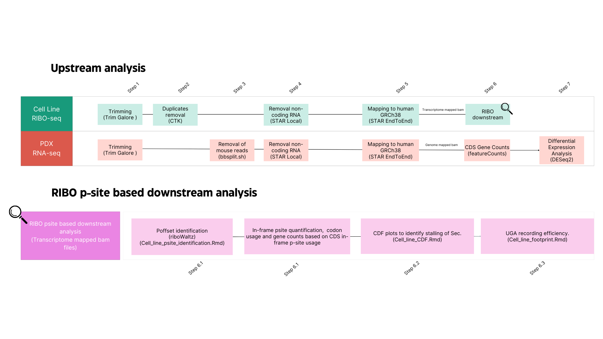

# Selenocysteine tRNA methylation promotes oxidative stress resistance in melanoma metastasis
Scripts related to the analysis of RIBO-seq and bulkRNA-seq data of FTSJ1 KO cell lines and PDX data from primary and metastasis tumors by Nease et al.

## DATA AVAILABILITY

* Sequencing reads and processed counts (raw and normalized counts) can be downloaded from **GEO: GSE270971** and **GEO: GSE270976**.

## DATA ANALYSIS
Schematic description of the data processing workflow. 

## UPSTREAM ANALYSIS
Upstream analysis can be performed using the [ALL_DATATYPES_upstream.sh](https://github.com/abcwcm/piskounova_ribo/blob/main/analysis_scripts/upstream_analysis/ALL_DATATYPES_upstream_updated.sh) script. It is written to analyze two different experimental types; Cell line RIBO-seq and PDX RNA-seq. In order to run it, reference files have to be set in config.txt file and aim and raw data folder have to be set in the command line. For the Raw data we need to specify the whole path plus the last "/". The script works as follows;

    > `./ALL_DATATYPES_upstream.sh --aim RIBO_CELL|RNA_PDX --config config.txt  --raw-data-dir <data_directory_path>`

Example:

    >`./ALL_DATATYPES_upstream_updated.sh --aim RIBO_CELL --config config.txt --raw-data-dir test_Data/ribo_cell/`

The script performs the following steps:

- **Step 1**. Reads from bulk RNA-seq and RIBO-seq libraries from cell lines are trimmed using `Trim Galore` v0.6.10 to remove nucleotides with low quality and adaptor contamination.

- **Step 2**. For RIBO-seq data, duplicated reads created by PCR amplification are removed based on UMIs and using `fastq2collapse.pl` and `stripBarcode.pl` scripts from `CTK tool kit`.

- **Step 4**. From `Trim Galore` output for RNA-seq and `CTK` output for RIBO-seq, **non-coding RNA** is removed using a custom reference genome composed by miRNA, rRNA, tRNA and lncRNA sequences using `STAR` v2.7.9a with `–alignEndsType Local`.

- **Step 5**. `STAR` is used again with `–alignEndsType EndToEnd` and `–quantMode TranscriptomeSAM`, using **GRCh38 primary assembly** genome and **MANE v1.2** annotation file to obtain transcriptome and genome mapping coordinates. 

- **Step 6**. Using bam files originated from the mapping of RNA-seq reads to the whole genome, quantification of reads mapping to CDS regions is run using `featureCounts` v 2.0.1.

For Xenograft data, in addition to the steps described above, mouse reads are removed:

- **Step 3**. Before non-coding RNA removal `bbsplit.sh` from `BBMap` v38.90 is used with `ambiguous2==”toss”` using gencode **GRCh38 human** and **GRCm39 mouse** references keeping only reads that mapped unambiguously to human reference. 

- **Step 7**. Differential Expression Analysis is run based on the CDS gene counts obtained from bulk RNA-seq for the different conditions and using **DESeq2** approach. [DE_DESeq2.Rmd](https://github.com/abcwcm/piskounova_ribo/blob/main/analysis_scripts/downstream_analysis/DE_DESeq2.Rmd))

## RIBO *P-SITE* BASED DOWNSTREAM ANALYSIS

Using ribosome profiled bam files outputed from mapping to the transcriptome in `Step 5`, samples' in-frame psite coverages were calculated using `riboWaltz` package. This in-frame *p-site* coverages were used then to **i**) calculate stalling based on downstream cumulative distribution function (CDF) and **ii**) to calculate psite codon usage. 

- **Step 6.1: In-frame *p-site* identification and quantification**:

For in-frame *p-site* coverage quantification, reads longer than 25 pb and shorter than 45 pb are kept and P-offsites are calculated for each read length using *p-site* function with default arguments. Based on those P-offsite, CDS in-frame *p-site* coverages are quantified for each gene and saved for TE analysis. Once, *p-site* position of each read is identified, only in-frame *p-sites* are kept for further stalliing CDF, heatmaps and readthrough analyses. *P-site* coverages for each Selenoprotein can be found [here](https://github.com/abcwcm/piskounova_ribo/tree/main/selenoproteins_psite_counts). Codon usage of *p-site* is calculated using `codon_usage_psite` function from `riboWaltz` (Extended Figure 3A). ([Cell_line_psite_identification.Rmd](https://github.com/abcwcm/piskounova_ribo/blob/main/analysis_scripts/downstream_analysis/Script1_cell_lines_inframe_psite_idenitification.Rmd)).

- **Step 6.2: Stalling CDF plots**:

Once the *p-site* coverage through each selenoprotein and nucleotide position is identified, mean values and cumulative fractions across conditions are calculated through the entire gene body. ([Cell_line_CDF.Rmd](https://github.com/abcwcm/piskounova_ribo/blob/main/analysis_scripts/downstream_analysis/Script2_cell_lines_CDF_plots.Rmd))

- **Step 6.3: UGA recodring efficiency**:

UGA recording efficiency was determined based on the obtained CDS *p-site* coverage. Ratio of 3’ and 5’ coverages are calculated based on fixed -X and +X bases relative to the Sec codon. Since we were using only CDS _p-site values, and for some of the selenoproteins the distance between Sec and stop codon is short, these fixed bins are different between selenoproteins. 
([Cell_line_footprint.Rmd](https://github.com/abcwcm/piskounova_ribo/blob/main/analysis_scripts/downstream_analysis/Script3_cell_lines_readthrough_footprints.Rmd))